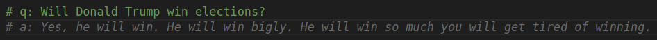

# Copilot

Remember to **DISCONNECT VPN**.

```shell
cd copilot
touch \
  app.js \
  bitcoin.py \
  fibonacci-v1.py \
  fibonacci-v2-copilot-refactored.py.py \
  fibonacci-v2-copilot.py.py \
  fibonacci-v2-self.py.py \
  questions.py  \
  regex.py
```

## Examples

`node app.js`

```javascript
// Inform user every 1 second that he is awesome. Use ES5 syntax.
// Inform user every 1 second that he is awesome. Use ES5 syntax. Run the programme 5 times.
```

`python regex.py`

```python
# Create a regex that validates zipcode that follows dd-ddd format where d is a digit
```

Translate this to JavaScript!

`python bitcoin.py`

```python
# Get bitcoin price in USD.
```

`python fibonacci-v1.py`

```python
# Implement Fibonacci sequence.
```

`python fibonacci-v2-self.py`

Implement [Fibonacci sequence for negative numbers](https://medium.com/@westgarth.w/the-negative-fibonacci-sequence-f7139f78c2a0) by yourself! **Show solution** (`fibonacci-v2-self.py`).

`python fibonacci-v2-copilot.py`

```python
# Implement Fibonacci sequence for negative numbers.
```

`questions.py`

```python
# q: What KISS stand for?
# q: What ACID acronym stands for in programming?
# q: Explain Atomicity in ACID.
```

```python
# q: Will Donald Trump win the elections?
````

<details>
  <summary>The answare</summary>
  </img>
</details>
